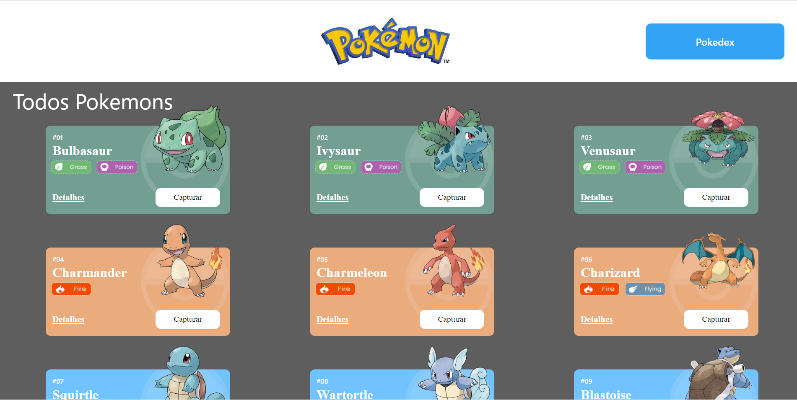
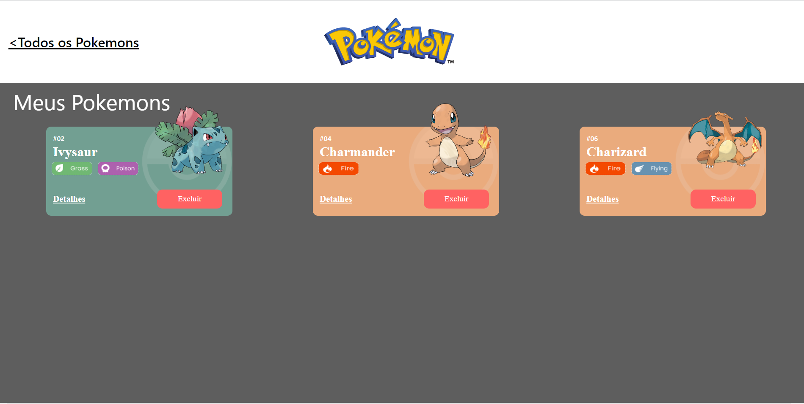
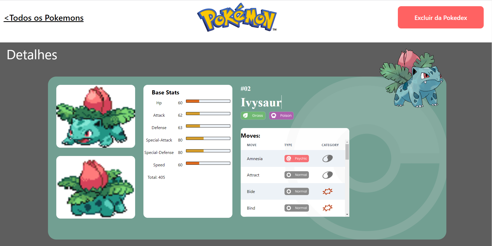

## Projeto Pokemon Pokedex API

Pokedex é uma enciclopédia do mundo Pokemon.

## Link Surge
    

## Imagens Projeto

 Home Page 

 Pokedex Page 

 Detail Page 

## Recursos Utilizados

<ul>
<li> ReactJS </li>
<li> ChakraUI </li>
<li> Visual Studio Code </li>
<li> Axios </li>
<li> PokeApi </li>
</ul>
